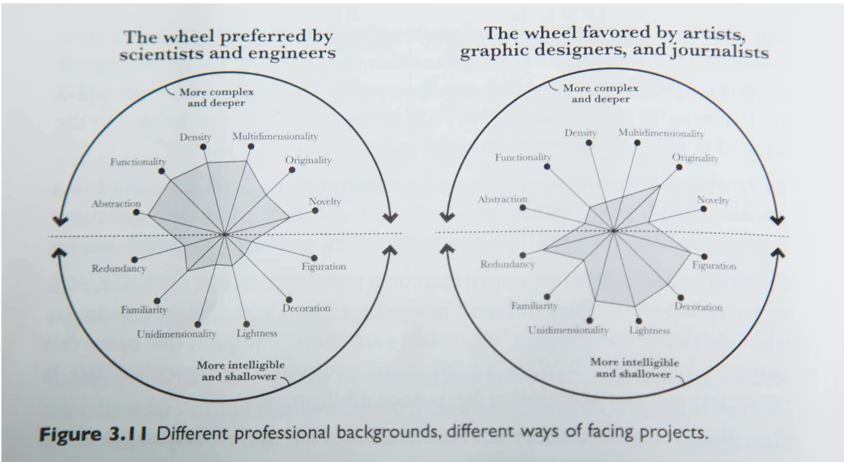

# intro 
making charts and graphs using matplotlib, seaborn and bokeh. using messy raw data and process it with panda and render it with meaningful images. 
------
# visualization wheel
## 1st dimension 
figuration - abstraction: dari charts atau objek beneran 
## 2nd dimension 
functionality - decoration: visualisasi data yang fungsional atau seperti hiasan 
### forming mental associations, which increases familiarity 
## 3rd dimension 
density - lightness: menyajikan informasi seperti di majalah (understand at a glance)
### 4th dimension 
multimensional - unidimensional: different aspects of phenomena - singe or a few aspects of phenomena 
### 5th dimension 
originality - familiarity: basic way to think about data in a graphical form for a broad population
### 6th dimension 
novelty - redudancy dimension:describing each phenomena in one way and tendency to tell same story in many way

------

# graphical heuristics
## data ink ratio
non erasable core of a graphic, arranged in a response to variation in numbers representation.
data-ink ratio: amount of data ink / total ink required to print the graphic 
improving the d-i ratio is by removing unessential added value to the graph itself: background
## chart junk 
- unintended graphical art: causing visual fatigue kayak moire di stripes on low-res screen  
- the grid. causes competition on seeing the data, use direct labeling 
- **the duck** non-data creative graphics. usually newspapers and magazines uses it.usually display data in a way memorable and aesthetically intrestings. tapi **the duck** ini membuat lebih gampang diingat dan asosiasi terhadap waktu yang lewat
## spark lines
bridging the gap between text and figures. Gives a general feeling for the trend behind the data
## Lie factor 
ambiguity in the graphics which represents the data. 

# truthful art 
## qualities of a great visualization 
### truthful 
selalu was pada terhadap apa yang dilakukan ketika cleaning, summarizing dan data manipulation. pastikan tidak melakukan: 
- self deception
- misleading 
### functionality
### beauty
### insightful 
### enlightening
